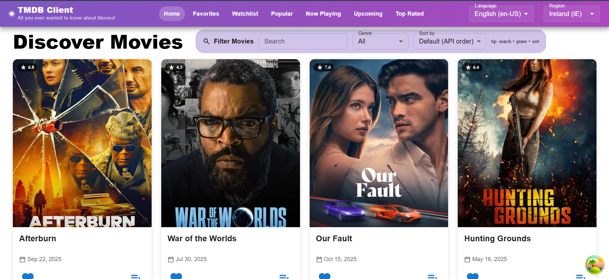

# 🎬 TMDB Client – Enhanced React Movie App

An enhanced React web application that connects to **The Movie Database (TMDB) API**, allowing users to explore, filter, and interact with movie data in a modern and responsive interface.  
This project extends the base coursework version with **pagination, improved design, Material UI components, and a dynamic watchlist system**.

---

## 🚀 Features Implemented

### 🎨 1. Modern UI / UX Redesign
- Updated **Site Header** with a purple gradient and responsive navigation bar.  
- Redesigned **Filter Bar** with MUI components and a soft lilac background.  
- Consistent color palette across all screens for a cohesive experience.  
- Improved movie card layout with rating badges, release dates, and hover effects.  

---

### 🧩 2. Core Functionality
- Displays movies using **TMDB API** (Discover, Popular, Upcoming, Now Playing, Top Rated).  
- Each movie card links to a **detailed page** with:
  - Movie overview  
  - Runtime, genres, and ratings  
  - Production countries  
  - Cast and crew (Director, Writers, Producers)  
    - Includes a **“More” button** to view the full cast and crew.  
  - **Recommended Movies** section with clickable movie cards that open their own detailed pages.  
- Each **actor card** in the Cast section is **clickable** and links to a **Person Page** that displays:
  - The actor’s photo, biography, and filmography (movies they appear in).  
  - Each movie on a Person Page is also clickable and links back to its detailed movie page.  

---

### ❤️ 3. Favorites and Watchlist
- Add or remove movies from:  
  - **Favorites**  
  - **Watchlist**  
- Managed globally using **React Context API (`MoviesContext`)**.  
- Automatically updates in real-time across all pages.  

---

### 🔍 4. Filtering and Sorting
- Filter movies by:  
  - Search title  
  - Genre  
  - Sort by release date or title.  
- Built with **Material UI Select**, **TextField**, and **Stack** components.  
- Fully responsive layout with a matching gradient background for better visual consistency.  

---

### 📄 5. Pagination
- Implemented pagination across pages using MUI’s `Pagination` component.  
- Available on:  
  - Home (Discover)  
  - Popular  
  - Upcoming  
  - Now Playing  
  - Top Rated  
- Smooth scroll-to-top behavior when changing pages for a better user experience.  

---

### 🌍 6. Language and Region
- User can switch between **languages** (English, Spanish, French) and **regions** (IE, US, GB, ES).  
- Integrated globally using context so all API requests automatically update when the user changes settings.  

---

### 🧠 7. Dynamic Linking
- Full data connectivity between movies, people, and recommendations:  
  - Clicking a **movie card** opens its **Movie Details Page**.  
  - Clicking an **actor card** opens their **Person Page**.  
  - Clicking a **recommended movie** opens a **new Movie Details Page** dynamically.  
- Provides an interconnected browsing experience similar to TMDB itself.  

---

### 🏠 Home Page

---

### 🧭 Project Structure

